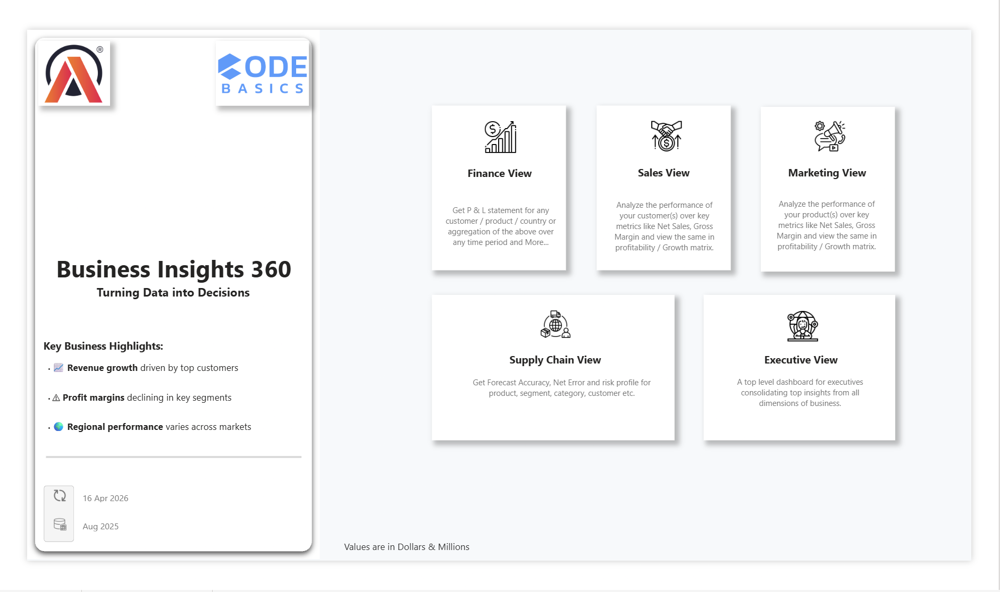
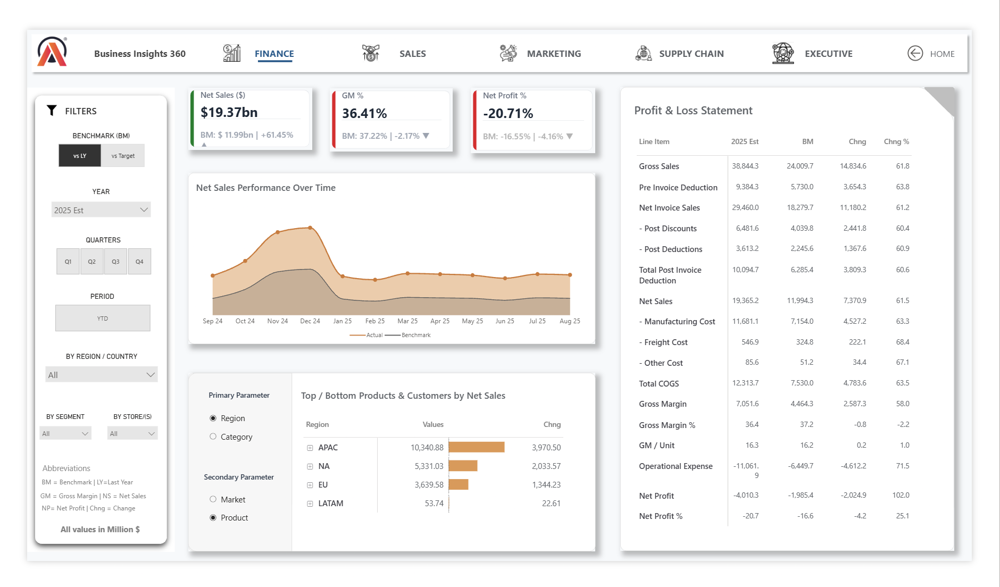
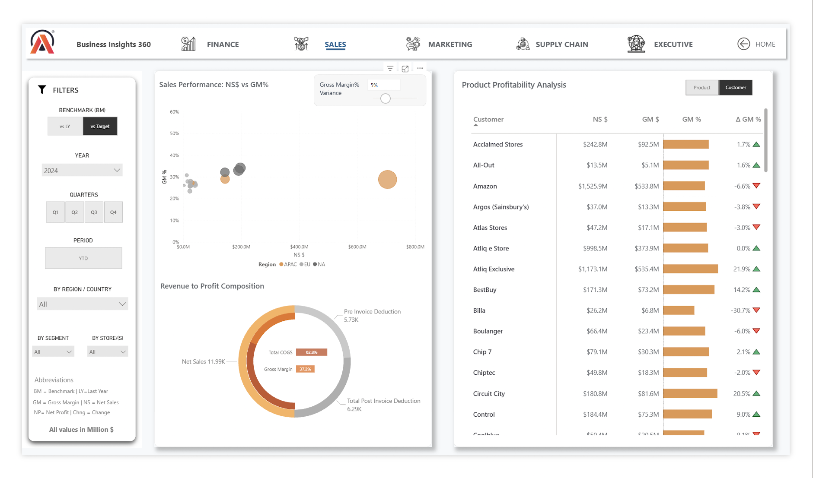
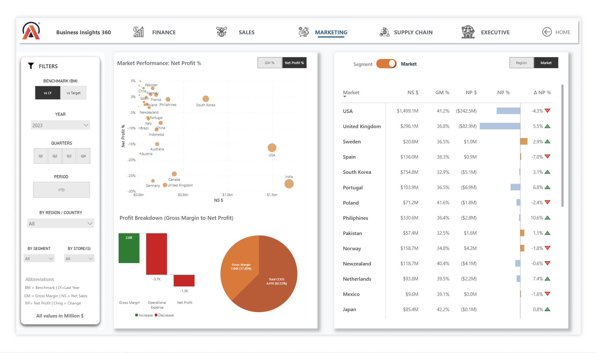
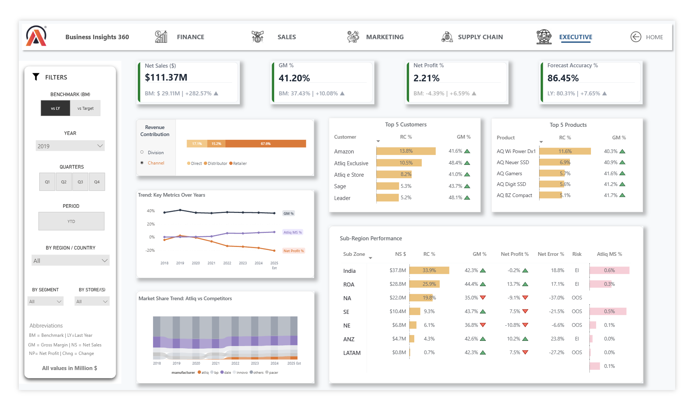

# business-insights-360-powerbi-dashboard
End-to-end Power BI dashboard delivering insights across Finance, Sales, Marketing, and Supply Chain using advanced DAX, field parameters, and interactive visuals.
# 📊 Business Insights 360 – End-to-End Power BI Dashboard

## 🚀 Project Overview

**Business Insights 360** is a comprehensive, enterprise-style Power BI dashboard designed to simulate real-world decision-making across multiple business functions.

This project goes beyond visualization — it focuses on **turning raw data into actionable insights** by enabling stakeholders to:

* Identify **profitability drivers**
* Detect **operational inefficiencies**
* Evaluate **forecasting performance**
* Compare **regional and segment-level trends**
* Make **data-driven strategic decisions**

---

## 💡 Business Problem

Organizations often struggle with:

* Fragmented insights across departments
* Lack of visibility into profitability vs revenue
* Poor understanding of forecast accuracy impact
* Difficulty in comparing performance across regions, products, and customers

👉 This dashboard solves these challenges by creating a **unified decision-making layer** across Finance, Sales, Marketing, and Supply Chain.

---

## 🎯 What This Dashboard Enables

* 📈 **Finance Leaders** → Track profitability, cost structure, and margin leakage
* 🛒 **Sales Teams** → Identify top/bottom customers and product performance
* 📊 **Marketing Teams** → Evaluate scale vs profitability using dynamic scatter analysis
* 🚚 **Supply Chain Teams** → Monitor forecast accuracy and error trends
* 👔 **Executives** → Get a consolidated, high-level business snapshot

---

## 🧩 Dashboard Views & Key Insights

### 💰 Finance View

* Dynamic **Profit & Loss Statement** using SWITCH-based modeling
* Trend analysis of **Net Sales vs Benchmark**
* Identification of **cost-heavy components (COGS, operational expenses)**

👉 Insight: Profitability is highly sensitive to operational cost fluctuations.

---

### 📈 Sales View

* **Customer & Product Profitability Analysis**
* Interactive tooltips showing trend context
* Revenue → Profit composition breakdown

👉 Insight: High revenue does not always translate into high profitability.

---

### 📊 Marketing View

* Dynamic **Scatter Plot (NS$ vs GM% / Net Profit%)**
* Toggle between **Region ↔ Market** using parameters & bookmarks
* Segment-level performance comparison

👉 Insight: Certain markets scale revenue at the cost of profitability.

---

### 🚚 Supply Chain View

* **Forecast Accuracy tracking**
* **Net Error & Absolute Error analysis**
* Combined **Accuracy vs Net Error trend visualization**
* Risk identification at customer & product level

👉 Insight: Forecast volatility directly impacts operational efficiency and risk exposure.

---

### 👔 Executive View

* Consolidated KPIs across all functions
* **Revenue contribution analysis**
* **Market share trends vs competitors**
* Sub-region performance breakdown

👉 Insight: Business performance is uneven across regions, requiring targeted strategies.

---

## ⚙️ Advanced Power BI Techniques Demonstrated

This project intentionally incorporates advanced, real-world techniques:

* 🔁 Field Parameters → Dynamic axis & dimension switching
* 🎯 Bookmarks → Seamless toggle between Segment vs Market views
* 🧠 Complex DAX:

  * `SWITCH`, `SUMX`, `CALCULATE`, `SELECTEDVALUE`
* 🏷 Dynamic Titles & Context-aware labels
* 📌 Reference Labels for KPI benchmarking
* 🎨 Conditional Formatting:

  * Data bars
  * Icons
* 📊 Composite Visuals:

  * Bar + Line charts
* 🧩 Structured modeling for dynamic P&L matrix

---

## 📸 Dashboard Preview

### 🏠 Home Page

### 💰 Finance View

### 📈 Sales View

### 📊 Marketing View

### 🚚 Supply Chain View

### 👔 Executive View

---

## 🔗 Live Dashboard

[View Interactive Dashboard](https://app.powerbi.com/view?r=eyJrIjoiYTJiYjcwZmUtYTAzMi00Njc0LWIzMDAtZmZjNDFiNDVkN2RkIiwidCI6ImM2ZTU0OWIzLTVmNDUtNDAzMi1hYWU5LWQ0MjQ0ZGM1YjJjNCJ9&pageName=cd0e2d6c9c3648aa0e30)

---

## 📊 Key Takeaways

* A small group of customers contributes disproportionately to revenue
* Profit margins vary significantly across segments and markets
* Forecast accuracy fluctuations create operational risk
* Regional performance is inconsistent, requiring localized strategies

---

## 🛠 Tools & Technologies

* Power BI
* DAX (Advanced)
* Data Modeling
* Excel (Data Source)

---

## 👨‍💻 About Me

**Aditya Shinde**
Graduate Student | Data Analytics & Supply Chain

---

## 📬 Let’s Connect

If you found this project insightful, feel free to connect or share feedback!
